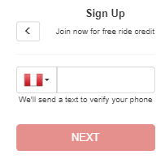

# Reto de Código - L Y F T

* **Track:** _Common Core_
* **Curso:** _Crea tu propia red social_
* **Unidad:** _Agiliza tu desarrollo_

***

## Objetivo

Crear una web-app que replique el sitio de Lyft, en este reto se requiere que un usuario se pueda registrar.

## Flujo de la aplicación
* Vista splash con duración de 2 segundos que redirecciona a la vista de inicio.
* La vista de inicio cuenta con dos botones, en esta ocasión seguiremos el flujo de SING UP. 
* En la siguiente vista (Vista formulario) se presenta un formulario donde el usuario puede escoger el país y debe ingresar su número de teléfono. El botón de NEXT está deshabilitado hasta que se ingrese un número de 10 dígitos. 
* Una vez ingresado el número de teléfono se habilita el botón y al dar click en el botón NEXT, se envía una alerta con un código generado aleatoriamente (LAB-000) y redireccionar a la siguiente vista. 
* En la siguiente vista (vista verificación) se debe ingresar el código dado anteriormente y una vez hecho esto se habilita el botón que redirecciona al usuario a la vista donde ingresa sus datos.
* En la siguiente vista (vista registro), el formulario pida nombre, apellido y correo electrónico. También tiene un checkbox para que se acepten los términos y condiciones del servicio.
* Ya que se ha realizado lo anterior, sólo se muestra una vista al usuario que le indica que ha concluido con el registro exitosamente. 

## Especificaciones

* Se trabajó en versión mobile.
* Se utilizó el framework Bootstrap en su versión 3.3.7.
* Se utilizó la librería jQuery en su versión 3.2.1.
* El archivo index.html contiene la estructura principal de la página, y se enlaza a los archivos main.css, app.js, data.js (en este archivo se guarda la información de los restaurantes), al framework Bootstrap y a la librería jQuery.
* En la carpeta vendors se almacenan los archivos correspondientes al framework Bootstrap y a la librería jQuery.
* En la carpeta views se almacenan los archivos html adicionales excepto el archivo index.html.
* En la carpeta “assets” se almacenan las imágenes utilizadas en el archivo html (images), los íconos (icons) y en el Readme.md (docs).
* La paleta de colores son los siguientes: rgba(83,0,96,1), rgba(197,8,128,1), #ccc y #fff

La estructura de la web-app es la siguiente:

**VISTA INICIO**

**VISTA FORMULARIO**

**CODIGO**

**VISTA VERIFICACION**

